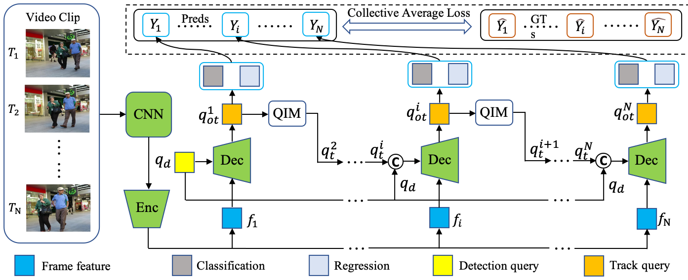

# MOTR

<!-- By [Xizhou Zhu](https://scholar.google.com/citations?user=02RXI00AAAAJ),  [Weijie Su](https://www.weijiesu.com/),  [Lewei Lu](https://www.linkedin.com/in/lewei-lu-94015977/), [Bin Li](http://staff.ustc.edu.cn/~binli/), [Xiaogang Wang](http://www.ee.cuhk.edu.hk/~xgwang/), [Jifeng Dai](https://jifengdai.org/). -->

<!-- This repository is an official implementation of the paper [Deformable DETR: Deformable Transformers for End-to-End Object Detection](https://arxiv.org/abs/2010.04159). -->

This repository is an official implementation of the paper [MOTR: End-to-End Multiple-Object Tracking with TRansformer].

## Introduction

**TL; DR.** MOTR is a fully end-to-end multiple-object tracking framework based on Transformer. It directly outputs the tracks within the video sequences without any association procedures.

<!--  -->
<div style="align: center">

</div>

**Abstract.** The key challenge in multiple-object tracking (MOT) task is temporal modeling of the object under track. Existing tracking-by-detection methods adopt simple heuristics, such as spatial or appearance similarity. Such methods, in spite of their commonality, are overly simple and insufficient to model complex variations, such as tracking through occlusion. Inherently, existing methods lack the ability to learn temporal variations from data. In this paper, we present MOTR, the first fully end-to-end multiple-object tracking framework. It learns to model the long-range temporal variation of the objects. It performs temporal association implicitly and avoids previous explicit heuristics. Built on Transformer and DETR, MOTR introduces the concept of “track query”. Each track query models the entire track of an object. It is transferred and updated frame-by-frame to perform object detection and tracking, in a seamless manner. Temporal aggregation
network combined with multi-frame training is proposed to model the long-range temporal relation. Experimental results show that MOTR achieves state-of-the-art performance. Code will be released.

## License

This project is released under the [Apache 2.0 license](./LICENSE).


<!-- ## Citing Deformable DETR
If you find Deformable DETR useful in your research, please consider citing:
```bibtex
@article{zhu2020deformable,
  title={Deformable DETR: Deformable Transformers for End-to-End Object Detection},
  author={Zhu, Xizhou and Su, Weijie and Lu, Lewei and Li, Bin and Wang, Xiaogang and Dai, Jifeng},
  journal={arXiv preprint arXiv:2010.04159},
  year={2020}
}
``` -->

## Main Results

|   Method   |  Dataset  |  MOTA  |  IDF1   |  IDS   |  URL   |  
|:------:|:------:|:------:|:------:|:------:|:------:|  
| MOTR | MOT16 | 62.2 | 62.6 | 575 | [model](s3://detr-mot/mot/paper_release/e2e_mot17_ch_val_joint.r50_dcn_deformable_detr.fixed_v2.iter.lr4.frame4.interval10.attn_merger_v3.epoch200.drop100.fp03.filter_iou.update_query_pos.no_dropout.hr.crop/checkpoint0164.pth) |
| MOTR | MOT17 | 62.5 | 62.2 | 1839 | [model](s3://detr-mot/mot/paper_release/e2e_mot17_ch_val_joint.r50_dcn_deformable_detr.fixed_v2.iter.lr4.frame4.interval10.attn_merger_v3.epoch200.drop100.fp03.filter_iou.update_query_pos.no_dropout.hr.crop/checkpoint0164.pth) |

*Note:*

1. All models of MOTR are trained on NVIDIA Tesla V100 GPU.
2. The original implementation is based on our internal codebase. There are slight differences in the final accuracy and running time due to the plenty details in platform switch.


## Installation

### Requirements

* Linux, CUDA>=9.2, GCC>=5.4
  
* Python>=3.7

    We recommend you to use Anaconda to create a conda environment:
    ```bash
    conda create -n deformable_detr python=3.7 pip
    ```
    Then, activate the environment:
    ```bash
    conda activate deformable_detr
    ```
  
* PyTorch>=1.5.1, torchvision>=0.6.1 (following instructions [here](https://pytorch.org/))

    For example, if your CUDA version is 9.2, you could install pytorch and torchvision as following:
    ```bash
    conda install pytorch=1.5.1 torchvision=0.6.1 cudatoolkit=9.2 -c pytorch
    ```
  
* Other requirements
    ```bash
    pip install -r requirements.txt
    ```

### Compiling CUDA operators
```bash
cd ./models/ops
sh ./make.sh
# unit test (should see all checking is True)
python test.py
```

## Usage

### Dataset preparation

Please download [MOT17 dataset](https://motchallenge.net/) and [CrowdHuman dataset](https://www.crowdhuman.org/) and organize them as following:

```
.
├── crowdhuman
│   ├── images
│   └── labels_with_ids
├── MOT15
│   ├── images
│   ├── labels_with_ids
│   ├── test
│   └── train
├── MOT17
│   ├── images
│   ├── labels_with_ids

```

### Training

#### Training on single node

For example, the command for training MOTR on 8 GPUs is as following:

```
bash run.sh

```

### Evaluation on MOT15

You can download the pretrained model of MOTR (the link is in "Main Results" session), then run following command to evaluate it on MOT15 train dataset:

```
bash eval.sh

```

### Evaluation on MOT17

You can download the pretrained model of MOTR (the link is in "Main Results" session), then run following command to evaluate it on MOT17 test dataset:

```
bash submit.sh

```